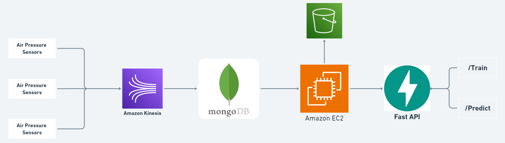
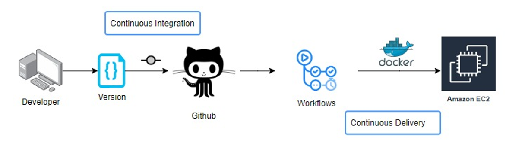

# Air Pressure System (APS) Sensor Fault Detection

## Problem Statement
The Air Pressure System (APS) is a critical component of a heavy-duty vehicle that uses compressed air to force a piston to provide pressure to the brake pads, slowing the vehicle down. The benefits of using an APS instead of a hydraulic system are the easy availability and long-term sustainability of natural air.

This is a Binary Classification problem, in which the affirmative class indicates that the failure was caused by a certain component of the APS, while the negative class indicates that the failure was caused by something else.

## Dataset Description
- The training set contains 36188 examples in total in which 35188 belong to the negative class and 1000 positive.

- The attribute names of the data have been anonymized for proprietary reasons. It consists of both single numerical counters and histograms consisting of bins with different conditions.

- In total there are 171 attributes and one target variable.

- Link for Dataset: https://drive.google.com/file/d/1jHWPdnzAKZIVFI5_UxaG-A6yV6E5mVGf/view?usp=sharing


## Tecnologies Used
- Python
- FastAPI
- Machine Learning Algorithms
- Docker
- MongoDB
- Github Action
- AWS Kinesis

## Prerequisites
- Python 3.9 or higher
- Docker
- AWS Account

## Archietecture

### Data Collection



###

### Project


### Deployment



### Installation
1. **Clone the repository**
    ```bash
    git clone 
    ```

2. **Create Conda Environment**
    ```bash
    conda create -p aps-sensor python==3.9 -y
    ```

3. **Activate the Environment and Install dependencies**
    ```bash
    pip install -r requirements.txt

4. **Configure the Environment Variables**
    ```bash
    export AWS_ACCESS_KEY_ID=<AWS_ACCESS_KEY_ID>

    export AWS_SECRET_ACCESS_KEY=<AWS_SECRET_ACCESS_KEY>

    export AWS_DEFAULT_REGION=<AWS_DEFAULT_REGION>

    export MONGODB_URL="mongodb+srv://<username>:<password>@ineuron-ai-projects.7eh1w4s.mongodb.net/?retryWrites=true&w=majority"

    ```
  
## Usage
1. **Run the Fast API Application**
    ```bash
    python main.py
    ```

2. **To Trigger Training Pipeline**
    ```
    http://localhost:8080/train
    ```

3. **For Prediction**
    ```
    http://localhost:8080/predict
    ```